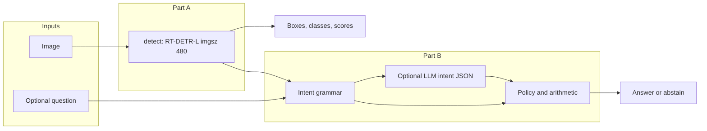
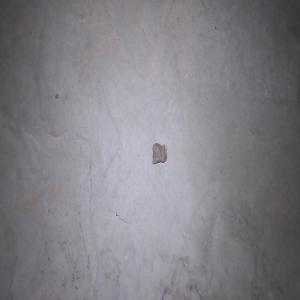
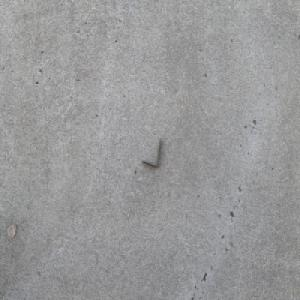

# RunwayGuard

Constrained RT-DETR detection and evidence-grounded question answering for **visible airport foreign-object debris (FOD)**. The system proposes inspection-priority candidates from a still image; runway clearance remains a human decision.

[Source](https://github.com/riyaz-ahamed-07/RunwayGuard) · [Weights](https://huggingface.co/DarkKnight1217/RunwayGuard-rtdetr-l) · [Demo](https://huggingface.co/spaces/DarkKnight1217/RunwayGuard-demo) · [API setup](docs/SUBMISSION.md)

---

## Architecture

| Component | Choice                                                           | Rationale                                                          |
| --------- | ---------------------------------------------------------------- | ------------------------------------------------------------------ |
| Detector  | Fine-tune **RT-DETR-L** on FOD-A                                 | Operational FOD labels beyond COCO                                 |
| Taxonomy  | 31 source labels → **7** classes                                 | More stable training; subtypes (e.g. screwdriver) are out of scope |
| Reasoning | Deterministic rules first; LLM optional for **intent JSON only** | Inspectable answers; no agent frameworks                           |

---

## Data and training

**Dataset**

- Source: [FOD-A v2.1](https://arxiv.org/abs/2110.03072)
- Size: **33,793** images at **300×300**, Pascal VOC boxes
- No extra scraped training data
- Label map: [`config/taxonomy.json`](config/taxonomy.json) (31 → 7 classes)
- [Annotation audit sheet](docs/figures/annotation_audit/annotation_audit_01.jpg) = label checks, not model predictions

**Split**

- Publisher split rejected: duplicate / overlapping IDs
- Also found **1,403** identical dHash groups across trainval and test (near-duplicate contamination risk)
- Replacement: grouped split ([`scripts/create_grouped_split.py`](scripts/create_grouped_split.py), seed **42**)
- Grouping signals: dHash distance ≤18, adjacent IDs, label tuples, environment tags
- Counts: **24,103** train · **4,808** val · **4,882** test
- Limit: leakage-risk heuristic — not a claim of video independence

**Training (frozen run)**

- Hardware: Colab Tesla T4
- Stack: Ultralytics **8.4.147**, AdamW `lr0=1e-4`, batch **8**, `imgsz=480`, seed **42**
- Duration: **11 epochs (~3.9 h)** — not a full 25-epoch schedule
- Best val mAP50–95: **0.65885** at epoch **7**
- Delivered weights: `best.pt` ([`results.csv`](docs/artifacts/results.csv))

---

## Results

Grouped-test metrics on the frozen checkpoint ([`test_metrics.json`](docs/artifacts/test_metrics.json)):

|        Metric |             Value | Notes                                          |
| ------------: | ----------------: | ---------------------------------------------- |
|     **mAP50** |         **0.755** | AP @ IoU 0.50                                  |
|  **mAP50–95** |         **0.636** | Mean AP across IoU thresholds                  |
| Library P / R | **0.734 / 0.812** | Ultralytics report; not API P/R at 0.25 / 0.50 |

**Per-class mAP50:** plastic_paper_debris 0.966 · component_container 0.940 · hand_tool 0.839 · fastener_hardware 0.821 · flexible_debris 0.761 · **loose_metal 0.541** · **natural_debris 0.418**.

Confidences are ranking scores, not calibrated probabilities. These are saved grouped-test numbers, not a hidden holdout.

**SHA256:** `C2D2A418069D9AC8658CA85B8359A9E1AB740CE96826C5138178B080F9243269`

---

## Failure analysis (5 cases)

Five mined failures at conf **0.25**, IoU **0.50**, shown as **source crops** (no prediction overlay). Causes are hypotheses. Adjacent frames can be near-duplicates — read related pairs as one confusion family where noted. Logs: [`failure_mine.json`](docs/artifacts/failure_mine.json), [`failure_small_miss.json`](docs/artifacts/failure_small_miss.json).

| Crop                                                                                            | Failure                                       | Next experiment                                              |
| ----------------------------------------------------------------------------------------------- | --------------------------------------------- | ------------------------------------------------------------ |
|                     | Tiny fastener (~0.23% of image); **no boxes** | Size-binned recall; validation crops / tiling                |
|   | GT loose metal; **extra** plastic/paper       | Box overlap + annotation completeness                        |
|       | Natural debris → metal (+ plastic/paper)      | Matched-box audit; rebalance natural vs metal                |
|           | Natural debris → metal only                   | Evaluate on distinct capture groups (near twin of row above) |
|  | GT loose metal; **extra** natural debris      | Per-box score / overlap (same scene family as 022564)        |

**Next priority:** tiny-object recall and fewer false candidates. These are proposed experiments, not reported improvements.

---

## Question answering and guardrails

[`/ask`](app/reasoning.py) routes each question to detect-needed, no-detection-needed, or unobservable. Evidence for `/ask` is collected at confidence **≥ 0.25** (fixed; callers cannot lower it). Affirmative answers require evidence **≥ 0.50**. Counts refer to predicted candidates. An empty detection set is never treated as proof of clear pavement.

Optional LLM phrasing ([`app/llm_phrase.py`](app/llm_phrase.py)) proposes **intent JSON only** over direct OpenAI HTTP. The service validates operations, categories, and evidence IDs, preserves protected local decisions, and falls back to the deterministic path on invalid proposals. No agent framework is used; the deterministic path needs no provider key.

| Example                                           | Outcome                                             |
| ------------------------------------------------- | --------------------------------------------------- |
| “Is the runway safe to reopen?”                   | `UNOBSERVABLE` / `INSUFFICIENT_INFORMATION`         |
| “Is there a screwdriver?” with `hand_tool` @ 0.93 | Abstain — trained class cannot resolve that subtype |

---

## Delivery

At the reviewed revision: checkpoint loads; real-image `/detect` and `/ask` return HTTP 200; **42** tests pass; public weights are reachable without authentication. Docker and demo assets are included. Setup and curl examples: [`docs/SUBMISSION.md`](docs/SUBMISSION.md).
