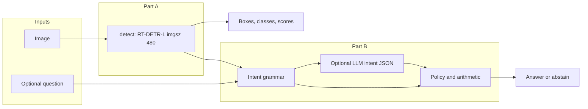
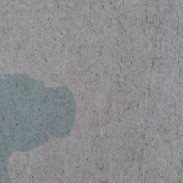
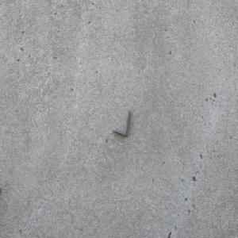
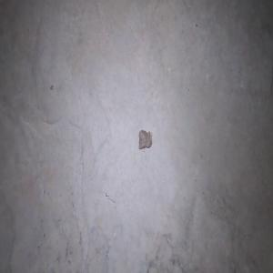
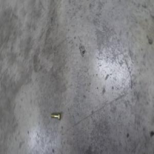
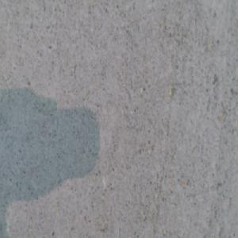

# MEMORANDUM

|             |                                                                                            |
| ----------- | ------------------------------------------------------------------------------------------ |
| **To**      | RAP Pre-Hackathon Screening reviewers                                                      |
| **From**    | Mohamed Riyaz Ahamed · RunwayGuard                                                         |
| **Date**    | 14 September 2026                                                                          |
| **Subject** | RT-DETR FOD detection + evidence-grounded `/ask` — decisions, metrics, failures, reasoning |

[Repo](https://github.com/riyaz-ahamed-07/RunwayGuard) · [Weights](https://huggingface.co/DarkKnight1217/RunwayGuard-rtdetr-l) · [Demo](https://huggingface.co/spaces/DarkKnight1217/RunwayGuard-demo) · [API setup](docs/SUBMISSION.md)

---

## 1. Purpose

RunwayGuard fine-tunes **RT-DETR-L** to locate **visible airport FOD candidates** in a still image and serves them through FastAPI `/detect` and `/ask`. It is an inspection aid: it does not authorize runway reopening or invent unobserved properties (material, mass, future damage).

This memo covers RAP’s required content: design decisions, frozen metrics, **five mined failures**, and the Part B reasoning layer.

---

## 2. System overview

| Decision  | Choice                                                             | Rationale                                                 |
| --------- | ------------------------------------------------------------------ | --------------------------------------------------------- |
| Detector  | Fine-tune **RT-DETR-L** on FOD-A                                   | Operational FOD labels beyond COCO                        |
| Taxonomy  | 31 → **7** classes ([`taxonomy.json`](config/taxonomy.json))       | Stable training; subtypes (e.g. screwdriver) out of scope |
| Reasoning | Handwritten intent + policy; LLM optional for **intent JSON only** | Inspectable answers; no agent frameworks / AutoML         |

---

## 3. Dataset and training method

**Dataset**

- [FOD-A v2.1](https://arxiv.org/abs/2110.03072): **33,793** images, 300×300, Pascal VOC; no scraped extras
- [Annotation audit sheet](docs/figures/annotation_audit/annotation_audit_01.jpg) = label checks, not predictions

**Split**

- Publisher split rejected: overlapping IDs + **1,403** identical dHash groups across trainval/test
- Grouped split ([`create_grouped_split.py`](scripts/create_grouped_split.py), seed **42**): dHash ≤18, adjacent IDs, label tuples, environment tags
- **24,103 / 4,808 / 4,882** train / val / test — leakage heuristic, not video-independence proof

**Training (frozen)**

- Colab T4 · Ultralytics **8.4.147** · AdamW `lr0=1e-4` · batch **8** · `imgsz=480` · seed **42**
- **11 epochs (~3.9 h)**; val mAP50–95 peak **0.65885 @ epoch 7** → `best.pt` ([`results.csv`](docs/artifacts/results.csv))

---

## 4. Results

|        Metric |             Value | Notes                                  |
| ------------: | ----------------: | -------------------------------------- |
|     **mAP50** |         **0.755** | Grouped test, IoU 0.50                 |
|  **mAP50–95** |         **0.636** | Mean over IoU thresholds               |
| Library P / R | **0.734 / 0.812** | Ultralytics; not API P/R @ 0.25 / 0.50 |

**Per-class mAP50:** plastic_paper 0.966 · component 0.940 · hand_tool 0.839 · fastener 0.821 · flexible 0.761 · **loose_metal 0.541** · **natural_debris 0.418**.

Scores are uncalibrated. Source: [`test_metrics.json`](docs/artifacts/test_metrics.json).  
**SHA256:** `C2D2A418069D9AC8658CA85B8359A9E1AB740CE96826C5138178B080F9243269`

---

## 5. Failure analysis

Five failures mined @ conf **0.25**, IoU **0.50** ([`memo_failure_ids.json`](docs/artifacts/memo_failure_ids.json)). Source crops only (no overlays). Causes are hypotheses. Crops are **visually distinct** capture families (near-duplicate adjacent IDs from the original mine are noted in text, not shown twice).

### F1 — Missed tiny fastener (`016303`)

- **Observation:** GT fastener ≈0.23% of image; **no boxes**
- **Next:** size-binned recall; validation crops / tiling

### F2 — Extra class on loose metal (`022564`)

- **Observation:** GT `loose_metal`; extra `plastic_paper_debris` (adjacent near-dupe `022573` swaps the FP class to `natural_debris`)
- **Next:** box-overlap / annotation audit; FP-class stability within a capture group

### F3 — Natural debris → metal (`027929`)

- **Observation:** GT `natural_debris` → `loose_metal` (+ plastic/paper); adjacent near-dupe `027930` is dHash-identical and predicts metal only
- **Next:** matched-box audit; rebalance natural vs metal; hold out non-adjacent groups

### F4 — Partial tiny-fastener miss (`012537`)

- **Observation:** GT tiny `fastener_hardware`; model returns a fastener box but still records a **false negative** under IoU 0.50 (localization / match failure on a small object)
- **Next:** tighten small-object localization; report size-binned precision–recall, not only mAP

### F5 — Missed fastener on stained pavement (`016440`)

- **Observation:** GT `fastener_hardware`; **no boxes** on a low-contrast / stained surface
- **Next:** hard-example mining on low-contrast pavement; photometric augmentation checks

**Priority:** tiny-object recall and fewer false candidates — proposed experiments, not claimed gains.

---

## 6. Reasoning layer (Part B)

[`app/reasoning.py`](app/reasoning.py) routes to detect-needed, no-detection-needed, or unobservable.

| Rule                  | Setting                         |
| --------------------- | ------------------------------- |
| `/ask` evidence floor | **≥ 0.25** (fixed)              |
| Affirmative answers   | evidence **≥ 0.50**             |
| No boxes              | never means “pavement is clear” |

Optional LLM ([`app/llm_phrase.py`](app/llm_phrase.py)): **intent JSON only**; validated ops / categories / evidence IDs; deterministic fallback; no agent frameworks.

| Example                             | Outcome                                     |
| ----------------------------------- | ------------------------------------------- |
| “Is the runway safe to reopen?”     | `UNOBSERVABLE` / `INSUFFICIENT_INFORMATION` |
| “Screwdriver?” + `hand_tool` @ 0.93 | Abstain (class too coarse)                  |

---

## 7. Conclusions

1. Frozen grouped-test mAP50 **0.755** / mAP50–95 **0.636**; weakest classes are natural debris and loose metal.
2. Publisher split was unsafe; grouped split reduces leakage risk but is still a heuristic.
3. Five mined failures span miss, false positive, class confusion, and small-object localization; crops are visually distinct capture families.
4. Part B guardrails keep answers inspectable under uncertainty.
5. Next: size-binned recall and capture-group held-out natural/metal tests.

**Verified locally:** checkpoint loads; real `/detect` & `/ask` HTTP 200; **42** tests; public weights. Details: [`docs/SUBMISSION.md`](docs/SUBMISSION.md).
