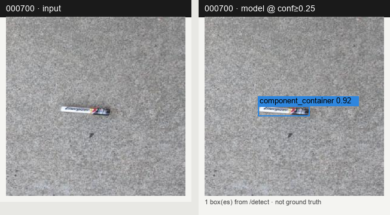
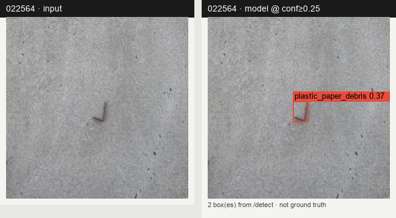
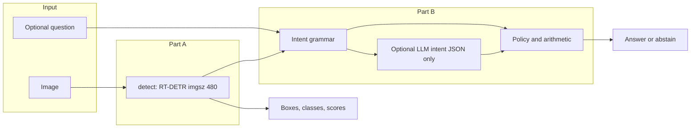
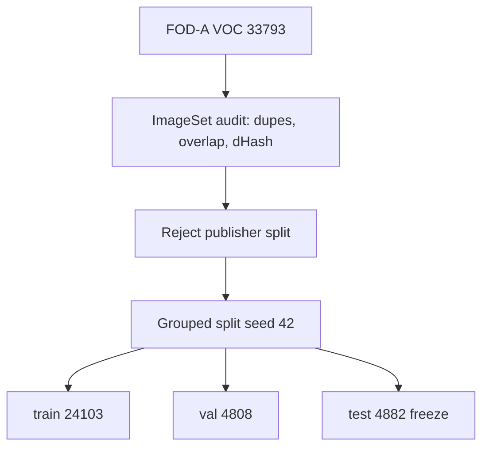

# RunwayGuard

Constrained **RT-DETR** object detection + FastAPI reasoning for **visible airport foreign-object debris (FOD)**.

Built for RAP Pre-Hackathon Screening (Round 1): Part A detection API, Part B structured intent + optional LLM intent JSON (no agent frameworks), reproducible training, honest evaluation.

|                  |                                                                          |
| ---------------- | ------------------------------------------------------------------------ |
| **Repo**         | https://github.com/riyaz-ahamed-07/RunwayGuard                           |
| **Weights**      | https://huggingface.co/DarkKnight1217/RunwayGuard-rtdetr-l (`best.pt`)   |
| **Live demo**    | https://huggingface.co/spaces/DarkKnight1217/RunwayGuard-demo            |
| **sha256**       | `C2D2A418069D9AC8658CA85B8359A9E1AB740CE96826C5138178B080F9243269`       |
| **Grouped-test** | mAP50 **0.755** · mAP50-95 **0.636** · Ultralytics P/R **0.734 / 0.812** |

| Endpoint       | Role                                                     |
| -------------- | -------------------------------------------------------- |
| `GET /health`  | Model readiness                                          |
| `POST /detect` | Classes, boxes, confidences                              |
| `POST /ask`    | Intent routing → structured reasoning → answer / abstain |
| `GET /`        | Reviewer UI (samples, Part B prompts, backend traces)    |

**Scope:** inspection-prioritization aid for _visible candidate debris_. It does **not** certify a runway as safe, replace authorized inspection, or invent unobserved facts (material, weight, future damage).

### Model predictions (real `/detect`, not ground truth)

Input (left) vs model boxes at confidence ≥ 0.25 (right). Regenerated with `python -m scripts.render_readme_examples`.







---

## Repository layout

```text
RunwayGuard/
├── app/                      # FastAPI + demo routes + static UI
│   └── static/               # Reviewer UI served at /
├── config/taxonomy.json      # 31 FOD-A labels → 7 operational classes
├── data_splits/              # Grouped train/val/test manifests (seed 42)
├── deploy/
│   ├── samples/              # Demo crops (Image 000700, …)
│   ├── gradio_app.py         # HF ZeroGPU Space entry helpers
│   └── README.md
├── docs/
│   ├── artifacts/            # results.csv, test_metrics.json, failure mine
│   ├── figures/
│   │   ├── annotation_audit/
│   │   └── predictions/      # README side-by-side model outputs
│   ├── hf/MODEL_CARD.md
│   └── SUBMISSION.md         # API + delivery links
├── notebooks/colab_train.ipynb
├── scripts/
├── tests/
├── weights/                  # Place best.pt here (gitignored)
├── train.py
├── evaluate.py
├── MEMO.md                   # ≤2-page written memo
└── Dockerfile
```

---

## Why this domain and dataset

| Choice   | Rationale                                                                                                                      |
| -------- | ------------------------------------------------------------------------------------------------------------------------------ |
| Problem  | Airport FOD is life-safety relevant; detection maps cleanly to boxes/classes                                                   |
| Dataset  | [FOD-A v2.1](https://github.com/FOD-UNOmaha/FOD-data) (MIT), Pascal VOC ([arXiv:2110.03072](https://arxiv.org/abs/2110.03072)) |
| Non-COCO | All seven target classes are operational FOD categories                                                                        |
| Framing  | Detector finds _visible candidates_; clearance stays a human decision                                                          |

FAA FOD context: <https://www.faa.gov/airports/airport_safety/fod>

---

## Dataset and split (audit-first)

**Source:** FOD-A v2.1 Pascal VOC. 33,793 images (300x300), 31 source labels, XML boxes.

**Official split was rejected.** Audit found duplicate list entries, IDs in both trainval and test, and **1,403 identical dHash groups** across the official split (proxy near-duplicate risk).

**Replacement:** deterministic **grouped split** (`scripts/create_grouped_split.py`, seed **42**):

| Split | Images |
| ----- | ------ |
| train | 24,103 |
| val   | 4,808  |
| test  | 4,882  |



**Taxonomy:** 31 → 7 operational classes in `config/taxonomy.json`:  
`fastener_hardware`, `hand_tool`, `flexible_debris`, `loose_metal`, `plastic_paper_debris`, `component_container`, `natural_debris`

---

## Constraints checklist

| Constraint                                  | Status                                                     |
| ------------------------------------------- | ---------------------------------------------------------- |
| RT-DETR fine-tune (Ultralytics)             | Yes: `train.py`                                            |
| >=1 non-COCO class                          | Yes: all 7                                                 |
| No LangChain / LangGraph / CrewAI / AutoGen | Yes: `app/reasoning.py` + optional OpenAI HTTP intent JSON |
| No AutoML                                   | Yes                                                        |
| Reproducible prep + train + eval            | Yes                                                        |
| Docker                                      | Yes: `Dockerfile`                                          |

---

## Model weights (Hugging Face)

Do **not** commit `.pt` files to git. Publish to a **public model** repo, then download locally.

### Upload (one-time, on your machine)

```powershell
pip install -U "huggingface_hub[cli]"
hf auth login

hf repo create RunwayGuard-rtdetr-l --type model --private false
hf upload DarkKnight1217/RunwayGuard-rtdetr-l hf_upload . --repo-type=model
```

### Download for API / Docker

```bash
hf download DarkKnight1217/RunwayGuard-rtdetr-l best.pt --local-dir weights
# PowerShell: Get-FileHash weights\best.pt -Algorithm SHA256
# expected: C2D2A418069D9AC8658CA85B8359A9E1AB740CE96826C5138178B080F9243269
export MODEL_PATH=weights/best.pt
```

---

## Reproduce data preparation

1. Download **FOD-A v2.1 Pascal VOC** (Drive id used in the notebook: `1RdErcq8PGRXZUOGauaACkQG44T-QyZ4x`).
2. Point at the folder that contains `Annotations`, `JPEGImages`, `ImageSets` (usually `VOC2007`).

```bash
python scripts/create_grouped_split.py --dataset-root /path/to/VOC2007 --output-dir data_splits

python scripts/convert_voc_to_yolo.py \
  --dataset-root /path/to/VOC2007 \
  --splits-dir data_splits \
  --taxonomy config/taxonomy.json \
  --output-dir prepared_data \
  --clean-output
```

---

## Training

**Recommended:** GPU Colab (`notebooks/colab_train.ipynb`). Recorded baseline: T4, batch 8, imgsz 480, **11** epochs logged; selected `best.pt` from val peak (~epoch **7**), not `last.pt`.

```bash
python train.py --data prepared_data/data.yaml --smoke-test

python train.py \
  --data prepared_data/data.yaml \
  --model rtdetr-l.pt \
  --epochs 25 \
  --imgsz 480 \
  --batch 8 \
  --device 0 \
  --seed 42 \
  --project runs \
  --name rtdetr_l_foda
```

| Item         | Value                                                                           |
| ------------ | ------------------------------------------------------------------------------- |
| Library      | Ultralytics `8.4.147`                                                           |
| Architecture | RT-DETR-L → `nc=7`                                                              |
| Optimizer    | AdamW, `lr0=1e-4`, `weight_decay=1e-4`                                          |
| Seed         | 42 (`deterministic=False`; CUDA deformable-attention backward is not bit-exact) |

---

## Evaluation

```bash
python evaluate.py \
  --weights weights/best.pt \
  --data prepared_data/data.yaml \
  --imgsz 480 \
  --batch 8 \
  --device 0 \
  --output docs/artifacts/test_metrics.json
```

Committed summary: `docs/artifacts/test_metrics.json` · curves: `docs/artifacts/results.csv`.

Headline mAP / library P/R come from Ultralytics COCO-style eval. They are **not** identical to API operating points at 0.25 / 0.50.

Mine memo failure IDs (CPU OK, Colab T4 faster):

```bash
PYTHONPATH=. python scripts/mine_failures.py --weights weights/best.pt --limit 200 --device 0
```

---

## Run the API

```bash
python -m venv .venv
# Windows: .venv\Scripts\activate
source .venv/bin/activate
pip install -r requirements.txt

# weights/best.pt must exist
uvicorn app.main:app --host 0.0.0.0 --port 8000
```

Reviewer UI: <http://localhost:8000/> · OpenAPI: <http://localhost:8000/docs>

### `POST /detect`

```bash
curl -s -X POST http://localhost:8000/detect \
  -F "image=@deploy/samples/000700.jpg" \
  -F "confidence=0.25"
```

### `POST /ask`

```bash
curl -s -X POST http://localhost:8000/ask \
  -F "image=@deploy/samples/000700.jpg" \
  -F "question=How many fasteners are visible?"
```

Safety / unobservable (no image required for this route class):

```bash
curl -s -X POST http://localhost:8000/ask \
  -F "question=Is the runway safe to reopen?"
```

### Part B policy

1. Deterministic intent grammar + arithmetic in `app/reasoning.py` (authoritative).
2. Optional OpenAI HTTP may propose **structured intent JSON only**; final sentence is always code-rendered. `RUNWAYGUARD_LLM=0` forces deterministic-only (Docker default).
3. `/ask` evidence confidence fixed at **0.25**; answers use ≥ **0.50**.
4. Shared **imgsz=480**. Subtype / unknown-target / negation / exclusion / spatial / colour questions abstain.

```bash
pytest -q
```

---

## Docker

```bash
docker build -t runwayguard .
docker run --rm -p 8000:8000 -e MODEL_PATH=/app/weights/best.pt -e RUNWAYGUARD_LLM=0 runwayguard
```

---

## Easy reviewer demo

**Public (no clone):** https://huggingface.co/spaces/DarkKnight1217/RunwayGuard-demo  
Free ZeroGPU Space — first load may be slow; visitors have a small daily GPU quota.

**Local UI:**

```bash
uvicorn app.main:app --host 0.0.0.0 --port 8000
```

http://localhost:8000/

Redeploy Space: `python scripts/deploy_hf_space.py` · notes: [`deploy/README.md`](deploy/README.md).

---

## Deliverables map (RAP)

| Deliverable             | Location                                                      |
| ----------------------- | ------------------------------------------------------------- |
| API and delivery links  | [`docs/SUBMISSION.md`](docs/SUBMISSION.md)                    |
| Written memo (≤2 pages) | [`MEMO.md`](MEMO.md)                                          |
| Source                  | this repo                                                     |
| Weights                 | https://huggingface.co/DarkKnight1217/RunwayGuard-rtdetr-l    |
| Bonus Docker / logging  | `Dockerfile`, `app/main.py`                                   |
| Live demo               | https://huggingface.co/spaces/DarkKnight1217/RunwayGuard-demo |

---

## License

Code in this repository is provided for the RAP screening submission. FOD-A data remains under its upstream MIT license; cite the FOD-A authors when redistributing derived artifacts.
